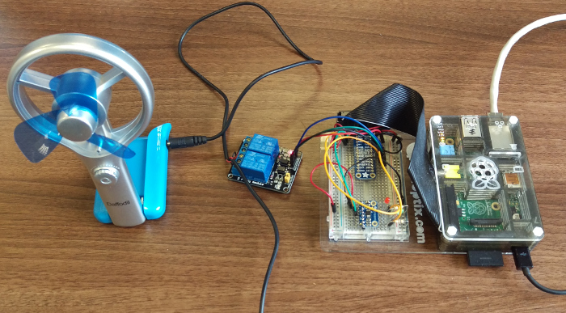

<!--
Copyright 2015 Richard Downer

Licensed under the Apache License, Version 2.0 (the "License");
you may not use this file except in compliance with the License.
You may obtain a copy of the License at

http://www.apache.org/licenses/LICENSE-2.0

Unless required by applicable law or agreed to in writing, software
distributed under the License is distributed on an "AS IS" BASIS,
WITHOUT WARRANTIES OR CONDITIONS OF ANY KIND, either express or implied.
See the License for the specific language governing permissions and
limitations under the License.
-->

Brooklyn entities for controller a temperature sensor and relay controller device
=================================================================================

This project consists of three parts:

* **Hardware**: a Raspberry Pi combined with an Adafruit MCP9808 temperature sensor breakout board and a 2-channel relay
  module
* **Server software**: a simple Python webserver which presents a web service for reading the temperature sensor, and
  for controlling the relay module channels
* **Brooklyn catalog items**: an entity and a policy which enables controlling the relay channels depending on the
  temperature reading

Disclaimer
----------

This project involves electronics. This means it involves electricity on exposed components and wires, and may also mean
that you have to do some soldering. You MUST be confident in your abilities to undertake the hardware part of this
project. If in doubt, stop and consult an expert.

Hardware
--------

The hardware wiring is very simple. This project was tested with a Raspberry Pi Model B (revision 2 of the original
design; not a B+ or a Model 2) although it should work on all current Raspberry Pi models.

The file [temperature.fzz](temperature.fzz) is a [Fritzing](http://fritzing.org) project that describes the hardware.
Alternatively, the hardware is very simple to wire up, as described below.

### MCP9808

This is an I2C temperature sensor. The [Adafruit MCP9808 High Accuracy I2C Temperature Sensor Breakout Board](https://www.adafruit.com/products/1782)
was used in this project.

Connect the sensor's GND, SDA and SCL pins to the equivalent on the Raspberry Pi; connect Vcc to the Raspberry Pi's 3V3
pin. All other pins on the sensor should be left unconnected.

### 2-channel relay module

There are many examples of these models being churned out of Chinese factories by different manufacturers, but which are
visually nearly identical. For example, [SainSmart 2-Channel 5V Relay Module](http://www.amazon.co.uk/SainSmart-2-Channel-Arduino-Mega2560-Duemilanove/dp/B005WR753Q).
These devices control a pair of relays; the Raspberry Pi's 3.3v GPIO pins aren't powerful enough to drive a relay
directly, but these modules contain some optocouplers that additionally use the Raspberry Pi's 5v pin to get enough
oomph to power the relay.

Connect the pins as follows:

- Raspberry Pi GND to module GND
- Raspberry Pi GPIO 23 to module In1
- Raspberry Pi GPIO 24 to module In2
- Raspberry Pi 5V0 to module Vcc

### The fan

I recommend obtaining a cheap, low power, USB-powered fan. Cut the power cable, strip back the wires, and install into
the relays - power on relay 1 and ground on relay 2. Wire it such that with the server running and before any API
calls are made, the 5v line is disconnected by the ground is connected. (The Brooklyn entities flip relay 1 only to
control the fan.)

Server software
---------------

[server.py](server.py) provides the web service for reading the sensor, and for controlling the relays. Please read the notes in
`server.py` for information on how to use it.

Entities
--------

Build the Java code with Maven, and install the resulting JAR file in `lib/dropins` of your Brooklyn installation. Then
apply the YAML blueprint in the file [temperature.yaml](temperature.yaml).
